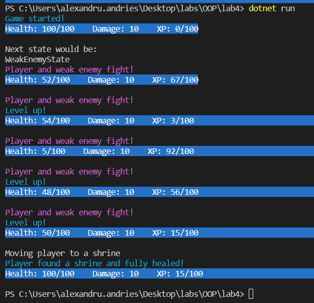

# lab 3 OOP

## Polymorphism

### Task: Add polymorphism and dependency injection to the project. Make scenarios of the simulation BUT STRICTLY NOT A SIMULATION THAT IS PROHIBITED

Polymorphism is present in every class which has dependencies injected, in the state machine for the simulation that is not running because of the restrictions and upcasting is used at least for the Tools class inside PlayableCharacter.

# Screenshots

