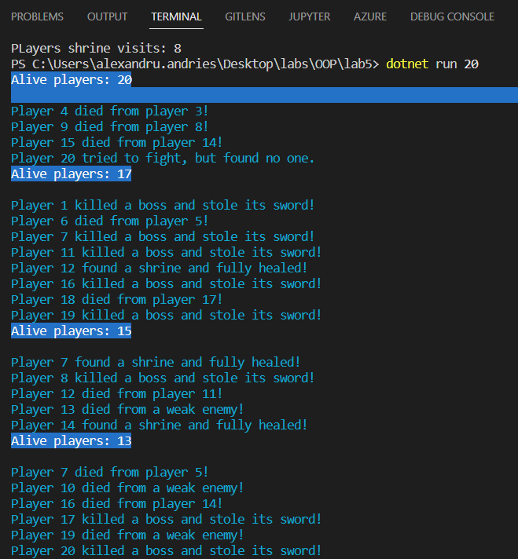
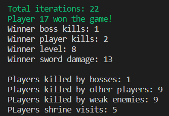
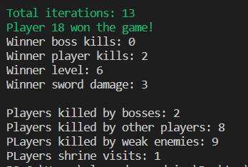
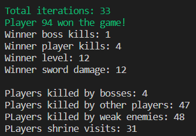

# lab 5 OOP

## Simulation (State machine)

### Task complete simulation, must be a 0 player game

The game spawns n number of players (specified as argument to program) and they go from one state to another until one player (the winner is alive). They start in the Initial state and the possible states that they can get through their journey are:
- Fighting weak enemies (they are not very lethal and give random XP)
- Fighting bosses (they are pretty lethal, rarer and drop a good sword)
- Fighting other players (If there are other players that are not doing an action yet, the fighter can move the other player to the pvp state and they fight till one dies. 2 levels are awarded to the winner)
- Finding a shrine (100% heal)

At the end of the game, stats are shown of the players. The winner often has at least 1 killed boss, as the upgraded sword gives a good chance of winning.
# Screenshots

100 players run:

